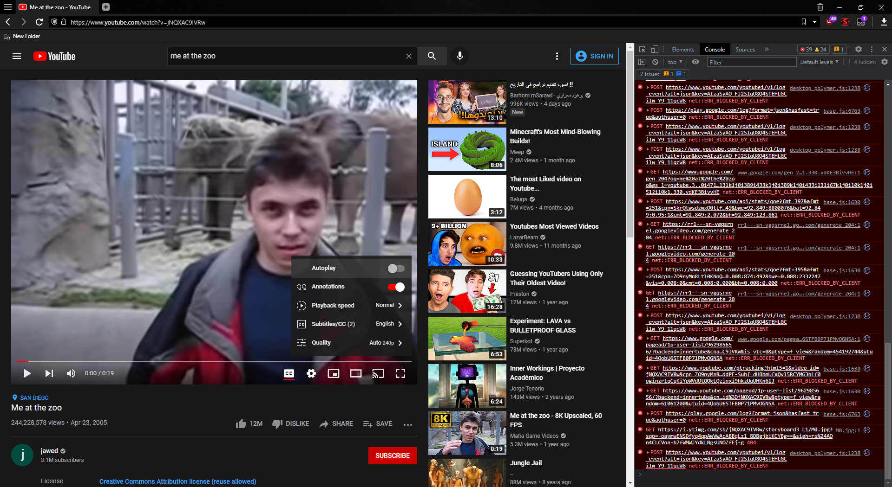

# YouTube Patch Collection

The latest and greatest experiment flag changer. Allows for changing normal flags **and** player flags on both Chrome and Firefox, consistently, with the same script for both.

*(Note: Currently, changing player flags does not work on Firefox. It is unknown why it does not, and I am looking into it.)*

## Preview



Here's the script running on Vivaldi (Chromium based). As you can see, we've changed both normal config flags, and player experiment flags.

## Installation

Make sure you have a UserScript manager like Tampermonkey, then click [here](https://raw.githubusercontent.com/aubymori/YouTubePatchCollection/main/YouTubePatchCollection.user.js).

## A bit of history...

This started with the "YouTube Config Editor" script which was... pretty awful to say the least. Literally all it did was do a `setInterval` every 1ms which set the flags and then cleared it after 1 second. I could not get it to load on Chrome a single time. The code is actually so tiny that I can put the entire thing here.

```js
(function() {
    window['yt'] = window['yt'] || {};
    yt['config_'] = yt.config_ || {};
    yt.config_['EXPERIMENT_FLAGS'] = yt.config_.EXPERIMENT_FLAGS || {};

    var iv = setInterval(function() {
        yt.config_.EXPERIMENT_FLAGS.kevlar_system_icons = false;
    }, 1);

    var to = setTimeout(function() {
        clearInterval(iv);
    }, 1000)
})();
```

Yikes. And then there was an actually good script! It had an actual method of setting the flags instead of just setting them every 1ms. It would set them very consistently, and it could change player flags too! Oh, and also, it only worked on Firefox. It uses the `beforescriptexecute` event, which is nonstandard and only works on Firefox. So any Chrome users were out of the equation.